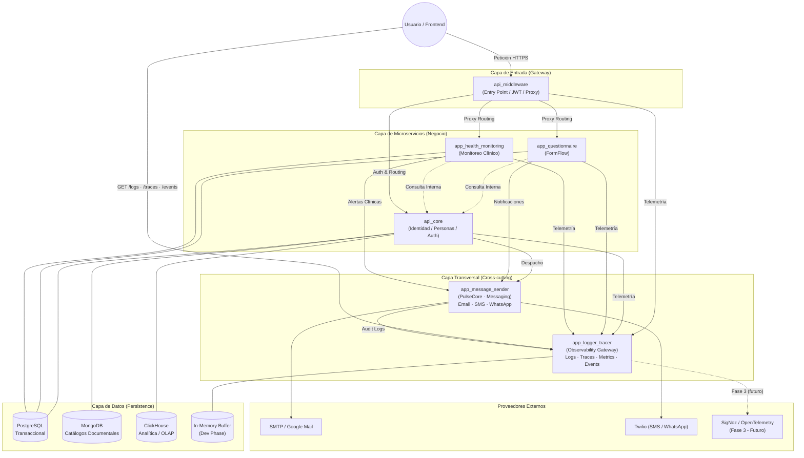
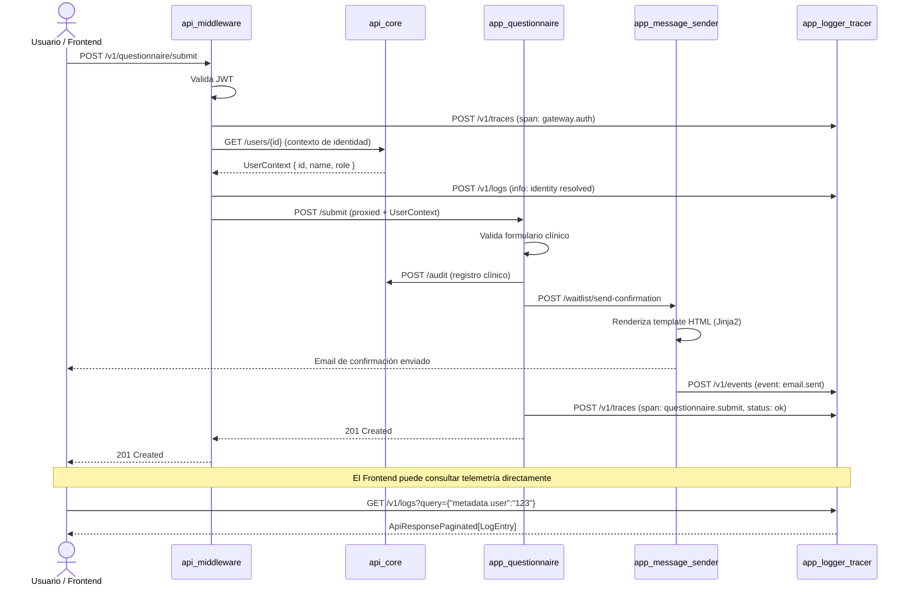
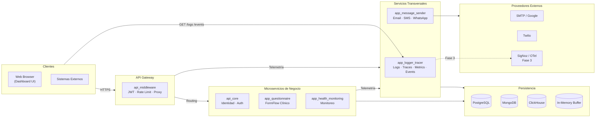

# Diagrama de Arquitectura Global - Hospital Digital

Este diagrama visualiza la interacción entre el Frontend, el Middleware, los microservicios de negocio y las capas transversales de observabilidad y mensajería del ecosistema.

## Descripción de Componentes

### Capa de Entrada (Gateway)
1. **api_middleware**: Único punto de entrada del ecosistema. Valida tokens JWT, aplica rate limiting y enruta el tráfico hacia los microservicios internos.

### Capa de Microservicios (Negocio)
2. **api_core**: Centro de gravedad para datos compartidos (Personas, Cuentas, Seguridad, Identidad). Todos los servicios lo consultan para obtener contexto del usuario.
3. **app_questionnaire**: Gestión de formularios clínicos y flujos dinámicos (FormFlow). Publica notificaciones de confirmación vía `app_message_sender`.
4. **app_health_monitoring**: Monitoreo clínico de signos vitales y alertas. Emite alertas críticas vía mensajería.

### Capa Transversal (Cross-cutting)
5. **app_logger_tracer** *(Observability Gateway)*: Sistema centralizado de ingesta de telemetría. Recibe Logs, Traces, Metrics y Events desde **cualquier microservicio, desde el API Gateway o incluso directamente desde el Frontend**. Expone endpoints `GET` para que cualquier consumidor consulte el historial de trazas y eventos con filtros dot-notation (`{"metadata.user": "123"}`).
6. **app_message_sender** *(PulseCore)*: Servicio de mensajería multi-canal con arquitectura de Providers intercambiables. Soporta Email (SMTP/Google), SMS y WhatsApp (Twilio). Registra toda actividad de despacho en `app_logger_tracer` para auditoría completa sin acoplar el núcleo de negocio.

### Capa de Datos (Multi-DB)
- **PostgreSQL**: Motor principal para datos transaccionales y relacionales.
- **MongoDB**: Almacenamiento documental para catálogos con estructuras dinámicas.
- **ClickHouse**: Motor OLAP para analítica masiva de baja mutabilidad y eventos.
- **In-Memory Buffer**: Buffer temporal de desarrollo para `app_logger_tracer` (Fase 1). Se reemplazará por RabbitMQ + SigNoz en Fases 2-3.

### Proveedores Externos
- **SMTP / Google Mail**: Proveedor de email transaccional para `app_message_sender`.
- **Twilio**: Proveedor para SMS y WhatsApp.
- **SigNoz / OpenTelemetry**: Backend de observabilidad real (Fase 3 del roadmap de `app_logger_tracer`).

## Decisiones Arquitectónicas Clave

| Decisión | Justificación |
| :--- | :--- |
| `app_logger_tracer` como capa transversal universal | Desacoplar la generación de telemetría del almacenamiento. Cualquier cliente (backend o frontend) puede ingestar y consultar señales. |
| `app_message_sender` con Provider Pattern | Intercambiar proveedores de mensajería (SMTP → SendGrid, Twilio → AWS SNS) sin tocar la lógica de negocio de ningún microservicio. |
| `app_message_sender` → `app_logger_tracer` para auditoría | Cada mensaje enviado queda registrado como `Event` en el Observability Gateway, dando trazabilidad completa sin código de auditoría duplicado. |
| Frontend con acceso directo a `app_logger_tracer` | Permite que el dashboard de observabilidad (`frontend/index.html`) consulte logs y trazas en tiempo real sin pasar por el Gateway, reduciendo latencia en herramientas de diagnóstico internas. |

---

## Diagrama 2 — Flujo de Secuencia (Ciclo de Vida de un Request)

Muestra el recorrido completo de una acción clínica típica a través del ecosistema, incluyendo la telemetría y la notificación como efectos secundarios.

---

## Diagrama 3 — Vista de Capas Horizontal (Layer Architecture)

Presenta la arquitectura como capas horizontales independientes, ideal para visualizar la separación de responsabilidades y los límites entre dominios.

