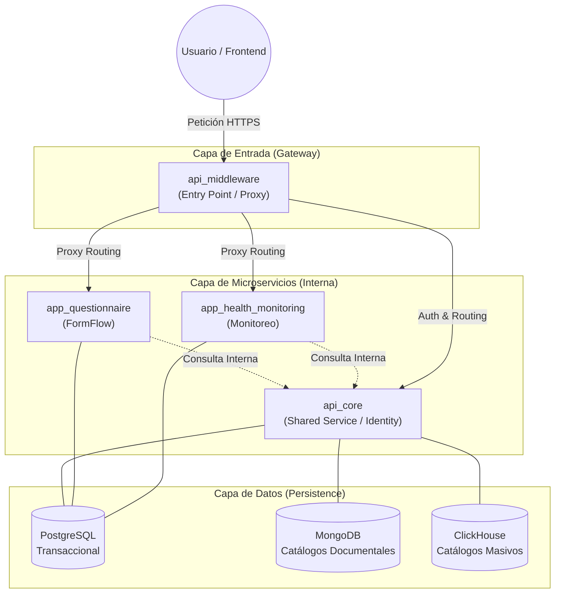

# Diagrama de Arquitectura Global - Hospital Digital

Este diagrama visualiza la interacción entre el Frontend, el Middleware y los diferentes microservicios del ecosistema.

## Descripción de Componentes

1.  **api_middleware**: Único punto de entrada. Realiza validación preliminar de JWT y rutea el tráfico.
2.  **api_core**: Centro de gravedad para datos compartidos (Personas, Cuentas, Seguridad).
3.  **Microservicios (`app_*`)**: Lógica de negocio aislada. Consultan a `api_core` para obtener contexto del usuario si es necesario.
4.  **Capa de Datos (Multi-DB)**:
    -   **PostgreSQL**: Motor principal para datos transaccionales y relacionales.
    -   **MongoDB**: Almacenamiento no relacional para catálogos con estructuras dinámicas o basadas en documentos.
    -   **ClickHouse**: Motor OLAP para el manejo eficiente de catálogos masivos y análisis de datos estadísticos de baja mutabilidad.
