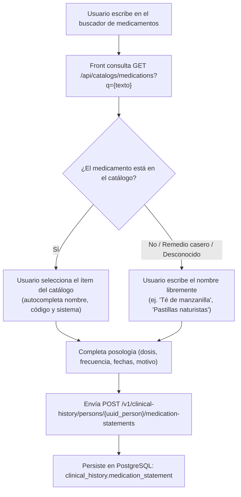

# Contrato de Componente: Medicación Declarada (`medication_statement`)

Especificación del contrato de API, flujo de interfaz de usuario y persistencia para el registro de medicamentos declarados o consumidos por el paciente en la Historia Clínica.

> **Estándar clínico:** HL7 FHIR R5 — [`MedicationStatement`](https://hl7.org/fhir/R5/medicationstatement.html).  
> **Diferenciación clave:** Este contrato modela el **consumo reportado por la persona** (`MedicationStatement`), **no** el catálogo farmacéutico general ([`catalogs.medication`](../../catalogs/clickhouse/medication.md) en ClickHouse), ni una receta médica emitida por un facultativo ([`MedicationRequest`](https://hl7.org/fhir/R5/medicationrequest.html)).

---

## 1. Flujo en Frontend / UI

El componente de interfaz para la captura de medicamentos de la persona opera con un patrón de **autocompletado flexible con fallback libre**:



### Casos de Envío

#### Caso A: Medicamento encontrado en el catálogo (Vademécum / ClickHouse)
El frontend envía el código formal del sistema correspondiente:
```json
{
  "medication_code_system": "ATC",
  "medication_code": "N05AX08",
  "name": "Risperidona 2mg tableta",
  "instructions": "1 tableta cada 24 horas por la noche",
  "status": "ACTIVE",
  "start_date": "2024-01-15",
  "end_date": null,
  "adherence_code": "ALWAYS",
  "information_source": "PATIENT",
  "uuid_conditions": ["01918a24-1a3b-7f12-8822-b91c32fa0001"]
}
```

#### Caso B: Medicamento no catalogado, remedio o nombre desconocido
El frontend deja en `null` el sistema y código, pero envía el nombre en texto libre:
```json
{
  "medication_code_system": null,
  "medication_code": null,
  "name": "Gotas para dormir naturistas (etiqueta verde)",
  "instructions": "10 gotas en medio vaso de agua antes de acostarse",
  "status": "ACTIVE",
  "start_date": "2025-06-01",
  "end_date": null,
  "adherence_code": "SOMETIMES",
  "information_source": "PATIENT",
  "uuid_conditions": []
}
```

---

## 2. Endpoints de API (Contrato REST)

Cumple con las normas [ADR 010](../../../decisions/010-database-id-strategy.md) (IDs externos en UUID), [ADR 024](../../../decisions/024-endpoints-uuid-only.md) (rutas solo con UUID), [ADR 034](../../../decisions/034-entity-uuid-single-path.md) (entidad única en paths de sub-recursos) y [ADR 035](../../../decisions/035-api-path-no-trailing-slash.md) (sin trailing slash).

### 2.1 Listar medicamentos de la persona
* **Método**: `GET`
* **Ruta**: `/v1/clinical-history/persons/{uuid_person}/medication-statements`
* **Query Params**:
  * `status` (opcional): `ACTIVE` | `COMPLETED` | `STOPPED` | `ALL` (default: `ACTIVE`).
* **Respuesta (200 OK)**:
```json
[
  {
    "uuid": "01918a24-9b8c-7f12-9922-b91c32fa0099",
    "uuid_person": "01918a00-3321-7111-9988-bbccddeeff00",
    "medication_code_system": "ATC",
    "medication_code": "N05AX08",
    "name": "Risperidona 2mg tableta",
    "dosage": {
      "text": "1 tableta por la noche",
      "timing": {
        "frequency": 1,
        "period": 1,
        "period_unit": "d"
      }
    },
    "instructions": "1 tableta cada 24 horas por la noche",
    "status": "ACTIVE",
    "start_date": "2024-01-15",
    "end_date": null,
    "date_asserted": "2024-01-15T10:00:00Z",
    "adherence_code": "ALWAYS",
    "information_source": "PATIENT",
    "notes": null,
    "conditions": [
      {
        "uuid": "01918a24-1a3b-7f12-8822-b91c32fa0001",
        "name": "Trastorno bipolar",
        "cie11_code": "6A60"
      }
    ]
  }
]
```

### 2.2 Registrar nueva declaración de medicación
* **Método**: `POST`
* **Ruta**: `/v1/clinical-history/persons/{uuid_person}/medication-statements`
* **Body**: `MedicationStatementCreateRequest`
* **Respuesta (201 Created)**: `MedicationStatementResponse`

### 2.3 Actualizar o suspender medicación
* **Método**: `PATCH`
* **Ruta**: `/v1/clinical-history/medication-statements/{uuid_medication_statement}`
* **Body**: `MedicationStatementUpdateRequest` (campos opcionales para actualizar posología, adherencia, o pasar a `status: STOPPED` indicando `end_date`).
* **Respuesta (200 OK)**: `MedicationStatementResponse`

### 2.4 Descartar o eliminar (Error de captura)
* **Método**: `DELETE`
* **Ruta**: `/v1/clinical-history/medication-statements/{uuid_medication_statement}`
* **Efecto**: Soft-delete / marca de estatus `ENTERED_IN_ERROR`.
* **Respuesta (204 No Content)**

---

## 3. Modelo Físico en Base de Datos (PostgreSQL)

### 3.1 Tabla: `clinical_history.medication_statement`

```sql
CREATE TABLE clinical_history.medication_statement (
    -- Identificadores (ADR 010)
    id                      INTEGER GENERATED ALWAYS AS IDENTITY PRIMARY KEY,
    uuid                    UUID NOT NULL DEFAULT uuid_generate_v7() UNIQUE,
    id_person               INTEGER NOT NULL REFERENCES people.person(id),

    -- Referencia al catálogo o texto libre (FHIR CodeableReference)
    medication_code_system  VARCHAR(50),    -- ej. 'ATC', 'COFEPRIS', 'RXNORM' (NULL si es texto libre)
    medication_code         VARCHAR(100),   -- código en el catálogo (NULL si es texto libre)
    name                    TEXT NOT NULL,  -- display name del catálogo o nombre declarado

    -- Posología y pauta
    dosage                  JSONB,          -- estructura FHIR Dosage[] estructurada
    instructions            TEXT,           -- texto legible ("1 tableta cada 8 hrs")

    -- Temporalidad y vigencia
    status                  VARCHAR(30) NOT NULL DEFAULT 'ACTIVE', -- ACTIVE, COMPLETED, STOPPED, ON_HOLD, ENTERED_IN_ERROR
    start_date              DATE,
    end_date                DATE,           -- NULL indica que continúa vigente
    date_asserted           TIMESTAMPTZ NOT NULL DEFAULT NOW(),

    -- Auditoría clínica y adherencia
    adherence_code          VARCHAR(30),    -- ALWAYS, SOMETIMES, NEVER, UNKNOWN
    information_source      VARCHAR(30) NOT NULL DEFAULT 'PATIENT', -- PATIENT, RELATIVE, CLINICIAN
    notes                   TEXT,

    -- Auditoría estándar (BaseModel)
    created_at              TIMESTAMPTZ NOT NULL DEFAULT NOW(),
    updated_at              TIMESTAMPTZ NOT NULL DEFAULT NOW(),
    deleted_at              TIMESTAMPTZ
);

CREATE INDEX idx_medication_statement_person ON clinical_history.medication_statement(id_person) WHERE deleted_at IS NULL;
CREATE INDEX idx_medication_statement_status ON clinical_history.medication_statement(id_person, status) WHERE deleted_at IS NULL;
```

### 3.2 Tabla puente: `clinical_history.medication_condition`
Liga la toma con el motivo clínico (`Condition`):

```sql
CREATE TABLE clinical_history.medication_condition (
    id                          INTEGER GENERATED ALWAYS AS IDENTITY PRIMARY KEY,
    id_medication_statement     INTEGER NOT NULL REFERENCES clinical_history.medication_statement(id) ON DELETE CASCADE,
    id_condition                INTEGER NOT NULL REFERENCES clinical_history.condition(id) ON DELETE CASCADE,
    CONSTRAINT uq_medication_condition UNIQUE (id_medication_statement, id_condition)
);
```

---

## 4. Activador de Cuestionarios (Anexo D — Instrumento DAI-10)

En el flujo de cuestionarios psicométricos ([`activation/anexo_d.mmd`](../../../diagrams/0_HISTORIA_CLINICA/activation/anexo_d.mmd)), el inventario **DAI-10** (*Drug Attitude Inventory*) se habilita si el paciente consume **fármacos antipsicóticos**.

### Regla de Evaluación:
Un paciente es candidato a responder el DAI-10 si cumple la condición:
```json
{
  "operator": "exists",
  "subject": {
    "entity": "medication_statement",
    "filter": {
      "status": "ACTIVE",
      "code_system": "ATC",
      "code_prefix": "N05A"
    }
  }
}
```
* Fármacos con código ATC que inician con `N05A` (Haloperidol, Risperidona, Olanzapina, Quetiapina, Aripiprazol, Clozapina, Clorpromazina, Flufenazina).
* Si el medicamento se seleccionó del catálogo de ClickHouse con código ATC `N05A%`, el sistema activa automáticamente el cuestionario DAI-10 sin intervención manual.
