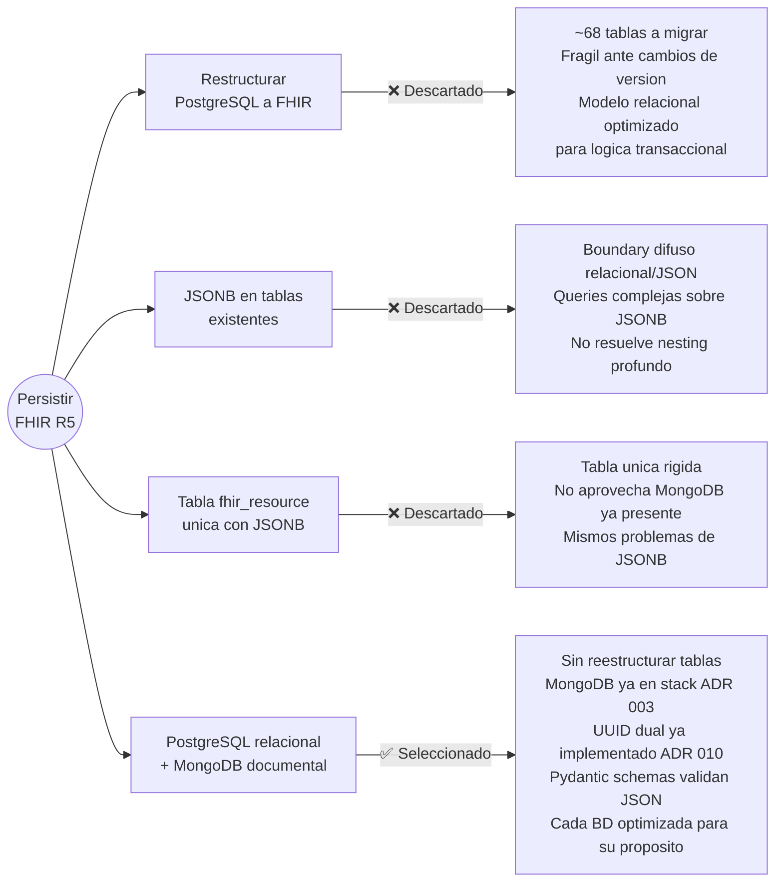
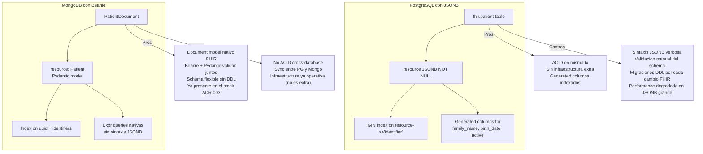
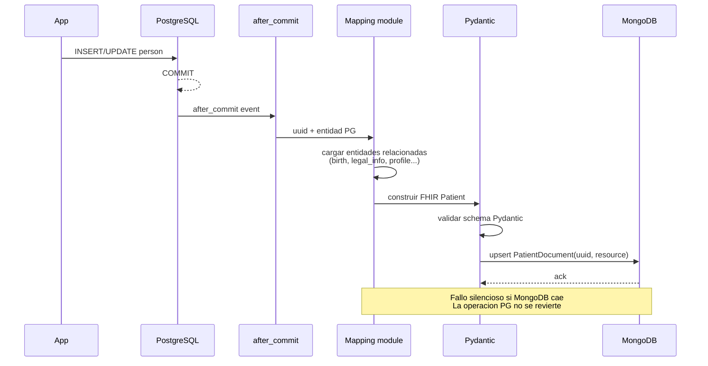
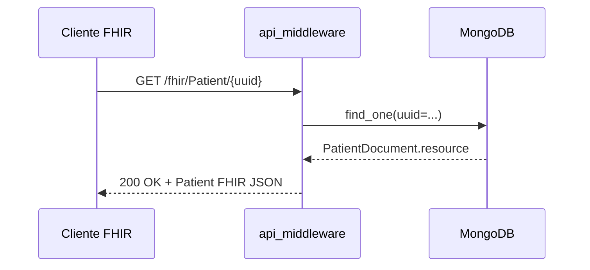
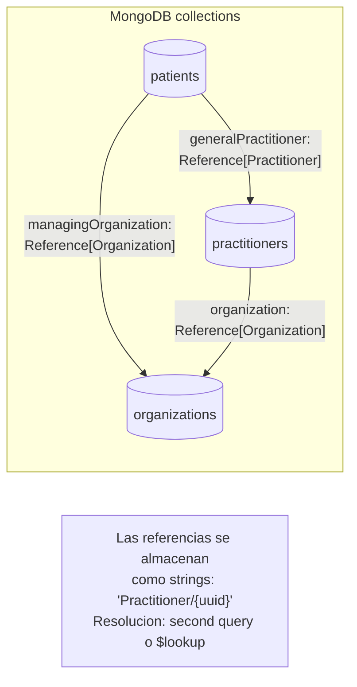
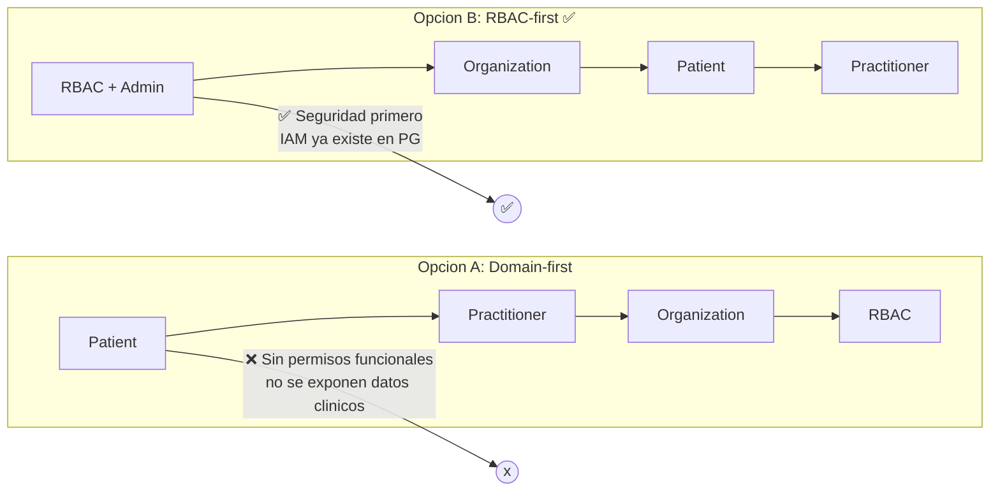
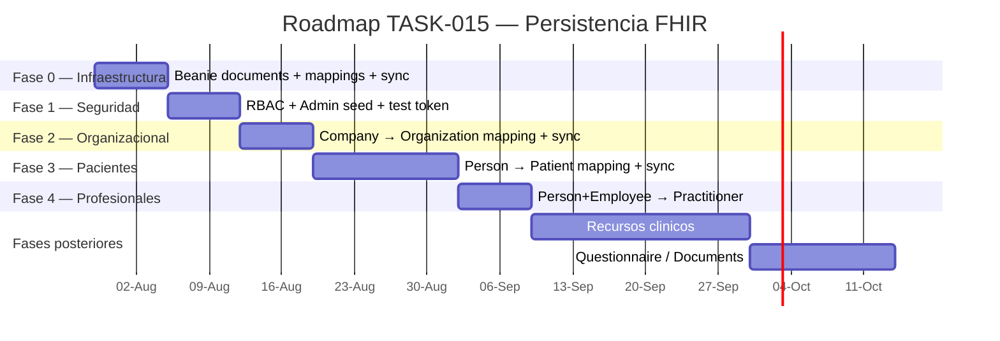
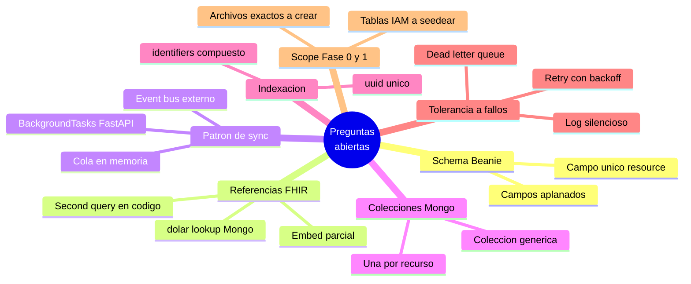
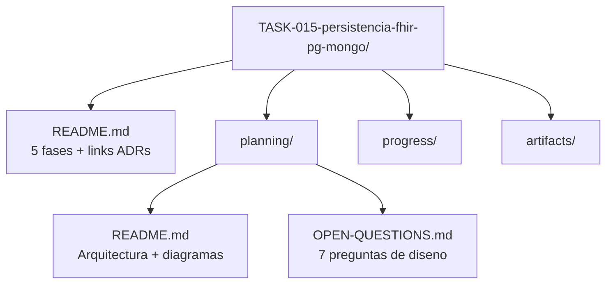

**Proyecto o Apartado:** Core Domain / dh_shared / FHIR R5 Persistencia

**Título de la actividad o tarea:** Plan de Persistencia Híbrida FHIR R5 — PostgreSQL + MongoDB

**Descripción de la actividad o tarea:**
Se diseño la estrategia de persistencia fisica para los recursos FHIR R5 implementados como schemas Pydantic en `dh_shared` (TASK-014 / ADR 036). El ADR 036 adopto FHIR R5 como estandar de interoperabilidad clinica pero dejo explicitamente sin decidir el almacenamiento fisico de los recursos. Esta sesion cierra esa brecha mediante el analisis de cuatro alternativas, la seleccion del enfoque hibrido PostgreSQL + MongoDB, y la creacion del TASK-015 con su plan de ejecucion y preguntas de diseno pendientes.

### Contexto

El ecosistema Digital Hospital cuenta actualmente con ~68 tablas PostgreSQL distribuidas en 9 schemas (`people`, `auth`, `iam`, `org`, `storage`, `health_profile`, `mfa`, `relationships`, `expedient`). Ademas, MongoDB ya esta operativo en el stack via Beanie ODM en `dh_onboarding` (waitlist) y `dh_logger` (logs, traces, metricas). Los 35 recursos FHIR R5 implementados como Pydantic schemas en `dh_shared` (TASK-014) no tienen aun una estrategia de persistencia definida.

### Alternativas evaluadas

Se evaluaron cuatro enfoques para persistir los recursos FHIR R5:



### Por que MongoDB y no JSONB en PostgreSQL

La pregunta central fue: si ambas opciones almacenan JSON, por que preferir MongoDB sobre una columna JSONB en PostgreSQL?



| Criterio | PostgreSQL JSONB | MongoDB (Beanie) |
|---|---|---|
| Modelo de datos | Relacional + JSON embebido (hibrido forzado) | Documental nativo (FHIR es documental) |
| Validacion de schema | Manual o via constraints | Pydantic + Beanie validan en runtime |
| Cambios de version FHIR | `ALTER TABLE` + migracion de datos GIN | Actualizar Pydantic model, sin DDL |
| Queries FHIR (`?identifier=...`) | `resource->>'identifier'` con GIN index | Index nativo sobre campos embebidos |
| Infraestructura | Ya presente (sin costo extra) | Ya presente (ADR 003, sin costo extra) |
| Transacciones ACID | ✅ Mismo commit | ❌ No atomico con PG (async sync) |
| Anidamiento profundo FHIR | Performance degrada con JSONB grande | Optimizado para documentos anidados |
| Stack existente | PostgreSQL en todos los servicios | MongoDB en `dh_onboarding` + `dh_logger` |

**Conclusion**: Ambas opciones son viables, pero MongoDB aprovecha mejor la naturaleza documental de FHIR (recursos anidados, campos opcionales, esquema flexible) y ya esta en el stack. PostgreSQL JSONB fuerza un modelo hibrido que no aporta ventaja sobre MongoDB cuando el caso de uso es exclusivamente documental. ACID cross-database no es necesario porque el sync es unidireccional y tolerante a fallos (fail-silent, mismo principio que ADR 006).

### Arquitectura seleccionada: Hibrido PostgreSQL + MongoDB

```mermaid
flowchart TB
    subgraph "Capa de Aplicacion"
        APP[App interna<br/>logica de negocio]
        FHIR_API[api_middleware<br/>FHIR endpoints]
    end

    subgraph "PostgreSQL — Modelo Relacional"
        PG_PERSON[(people.person<br/>+ birth, legal_info,<br/>sociocultural, profile)]
        PG_COMPANY[(org.company<br/>+ location)]
        PG_EMPLOYEE[(org.employee)]
        PG_IAM[(iam.tenant<br/>role, permission)]
    end

    subgraph "Capa de Sync"
        HOOK[SQLAlchemy<br/>after_commit hook]
        MAP[Mapping module<br/>PG entity → FHIR JSON]
        VAL[Validacion<br/>Pydantic schema]
    end

    subgraph "MongoDB — Documentos FHIR"
        MON_PAT[(patients<br/>PatientDocument)]
        MON_ORG[(organizations<br/>OrganizationDocument)]
        MON_PRAC[(practitioners<br/>PractitionerDocument)]
    end

    APP -->|CRUD relacional| PG_PERSON
    APP -->|CRUD relacional| PG_COMPANY
    APP -->|CRUD relacional| PG_EMPLOYEE
    APP -->|CRUD relacional| PG_IAM

    PG_PERSON -->|after_commit| HOOK
    PG_COMPANY -->|after_commit| HOOK
    PG_EMPLOYEE -->|after_commit| HOOK

    HOOK --> MAP
    MAP --> VAL
    VAL -->|upsert by uuid| MON_PAT
    VAL -->|upsert by uuid| MON_ORG
    VAL -->|upsert by uuid| MON_PRAC

    FHIR_API -->|GET /fhir/Patient/{uuid}| MON_PAT
    FHIR_API -->|GET /fhir/Organization/{uuid}| MON_ORG
    FHIR_API -->|GET /fhir/Practitioner/{uuid}| MON_PRAC

    APP -.->|lectura interna<br/>sin FHIR| PG_PERSON
```

### Flujo de escritura: PostgreSQL → MongoDB



### Flujo de lectura: FHIR API desde MongoDB



### Referenciacion entre recursos FHIR en MongoDB



### Orden de fases: RBAC-first

Se evaluaron dos ordenamientos para la migracion por microservicio:



**Razon de seleccion**: RBAC debe estar funcional antes de exponer cualquier endpoint FHIR que sirva datos clinicos. El IAM ya existe en PostgreSQL (`iam.tenant`, `iam.membership`, `iam.role`, `iam.permission`) — solo requiere seed de admin y verificacion. Organization se hace antes que Patient porque no depende de personas.

### Roadmap de fases — TASK-015



### Preguntas de diseno pendientes

Antes de escribir codigo, se identificaron 7 preguntas arquitectonicas que deben resolverse. Cada una tiene 2-3 alternativas viables con trade-offs documentados en `docs/tasks/TASK-015-persistencia-fhir-pg-mongo/planning/OPEN-QUESTIONS.md`:



### TASK-015: Estructura creada

Se creo la estructura completa del task en `docs/tasks/TASK-015-persistencia-fhir-pg-mongo/`:



| Archivo | Contenido |
|---|---|
| `TASK-015/README.md` | Frontmatter YAML, 5 fases con checklist, enlaces a ADRs 003/005/010/036 |
| `planning/README.md` | Decision hibrida (4 alternativas descartadas), diagrama Mermaid, flujo write/read, estructura de archivos propuesta, patron Beanie, criterios de aceptacion |
| `planning/OPEN-QUESTIONS.md` | 7 preguntas abiertas: schema Beanie, referencias, sync pattern, colecciones, indexacion, tolerancia a fallos, scope |

### ADRs relacionados

| ADR | Relevancia |
|---|---|
| [003 — Polyglot Persistence](../decisions/003-estrategia-multi-base-de-datos.md) | Autoriza PostgreSQL + MongoDB como motores complementarios |
| [005 — MongoDB Driver + Lifespan](../decisions/005-mongodb-driver-and-fastapi-lifespan.md) | `pymongo.AsyncMongoClient` via Beanie, init en `lifespan` |
| [010 — Database ID Strategy](../decisions/010-database-id-strategy.md) | UUID dual como link natural PG ↔ MongoDB |
| [036 — FHIR R5 Adoption](../decisions/036-fhir-r5-adoption.md) | Schemas Pydantic FHIR — dejo pendiente la persistencia fisica |

**Estado de la actividad o tarea:** Concluido

**Avances de la actividad (si lo requiere):**
- Analizadas 4 alternativas de persistencia FHIR (restructurar PG, JSONB en tablas, JSONB tabla unica, hibrido PG+Mongo).
- Seleccionado enfoque hibrido PostgreSQL + MongoDB con vinculo via UUID dual (ADR 010).
- Definido orden RBAC-first: RBAC → Organization → Patient → Practitioner → clinicos.
- Creado TASK-015 con estructura completa: `README.md` (5 fases), `planning/README.md` (arquitectura + diagramas Mermaid), `planning/OPEN-QUESTIONS.md` (7 preguntas de diseno pendientes).
- Actualizado `docs/tasks/README.md` y `docs/management/backlog.md` con TASK-015.
- No se requiere ADR adicional: ADRs 003, 005, 010 y 036 ya cubren la decision de arquitectura.
- Proximo paso: resolver las 7 preguntas abiertas en `planning/OPEN-QUESTIONS.md` antes de iniciar la Fase 0.