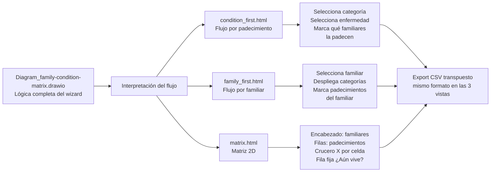

**Proyecto o Apartado:** Historia Clínica / Antecedentes Heredo-Familiares (AHF)

**Título de la actividad o tarea:** Análisis del flujo de padecimientos heredofamiliares y prototipo de UI multi-vista

**Descripción de la actividad o tarea:**
Se interpretó el diagrama de flujo `Diagram_family-condition-matrix.drawio` que define la lógica del módulo de **Antecedentes Heredo-Familiares (AHF)** y, ante la complejidad de representar el flujo completo dentro de un único diagrama, se construyeron **tres prototipos de interfaz de usuario** autónomos en HTML para explorar distintos caminos de captura y evaluar el más viable antes de comprometer un diseño final.

### Contexto

El diagrama fuente captura la idea del wizard: por cada familiar (6 miembros: Padre, Madre, Abuelo paterno, Abuela paterna, Abuelo materno, Abuela materna) se navega 13 categorías de padecimientos (4.1–4.13), cada una con un conjunto de enfermedades y una opción `Otro (Especifique)`, e intercala dos loops de decisión —"¿Desea completar los antecedentes de otro familiar?" y "¿Otro padecimiento?"— además de capturar si el familiar vive y, en su caso, la causa de fallecimiento.

Representar este flujo completo en un diagrama de flujo se vuelve **complejo por la cantidad de decisiones anidadas**: 6 familiares × 13 categorías × N padecimientos × loops de confirmación × "¿Vive?" × causa × texto personalizado del "Otro". La anidación de decisiones y la repetición de los loops generan un grafo extenso, difícil de leer como especificación y sujeto a inconsistencias. Por ello se optó por materializar el flujo en prototipos navegables antes de perpetuarlo como diagrama.

### Enfoque: tres vistas prototipo

En lugar de un único diagrama, se construyeron tres vistas HTML autónomas (sin backend) que capturan el mismo modelo de datos pero recorren el flujo desde direcciones distintas, con el fin de evaluar cuál ofrece menor fricción al usuario:



Cada vista reside en `docs/historial_clinico/diagram_family_condition/` y es completamente autónoma (HTML + CSS + JS embebidos, sin dependencias salvo Material Symbols Rounded).

### Problemas resueltos durante el prototipado

Durante la interpretación del diagrama se identificaron tres problemas reales del catálogo que cualquier implementación debía resolver:

1. **Colisión del "Otro"**: cada categoría (4.1–4.13) termina en una opción `Otro`. Usar el nombre plano `Otro` como clave de estado haría que seleccionar "Otro" en una categoría marcara el "Otro" de todas las demás. Se resolvió con **claves de estado compuestas** `catId||disease` (en `matrix.html` se aplican a todos los padecimientos; en las otras dos solo al "Otro").
2. **Texto personalizado del "Otro" por familiar**: el usuario puede escribir un padecimiento libre. Sin una clave por familiar, el texto de un miembro sobrescribiría al de otro. La granularidad de la clave **difiere por vista** (ver tabla siguiente) y queda explicitada en el encabezado del `<script>` de cada archivo.
3. **Duplicidad de "¿Vive?"**: preguntar si el familiar vive en cada padecimiento genera redundancia y fricción. Se **elevó la pregunta al ámbito del familiar**: se responde una vez por miembro y el estado se conserva durante la sesión.

Adicionalmente, los dos loops de confirmación del diagrama ("¿Otro familiar?" / "¿Otro padecimiento?") se eliminaron de la UI: se reemplazan por un botón "Agregar familiar" (+) y por selección múltiple mediante checkboxes, evitando pasos intermedios de confirmación. El texto libre ("Otro" y causa de fallecimiento) se capitaliza en JavaScript (`capFirst` en vivo, `capSpec` al salir) —no con CSS— para que el valor exportado ya llegue formateado.

### Evaluación comparativa de las vistas

| Criterio | `condition_first.html` | `family_first.html` | `matrix.html` |
|---|---|---|---|
| Dirección del flujo | Padecimiento → familiares | Familiar → padecimientos | Vista global 2D |
| "¿Vive?" | Radios en tarjeta del sidebar | Radios en tarjeta del sidebar | Fila fija, checkbox marcado por defecto |
| Texto "Otro" | Compartido por categoría | Por miembro | Por coordenada (familiar × padecimiento) |
| Carga cognitiva | Alta (cambia de contexto por cada enfermedad) | Media (concentra un familiar a la vez) | Baja (visión global, but denso) |
| Idoneidad | Familiariza con un padecimiento concreto | Revisión completa de un familiar | Auditoría/comparación rápida entre familiares |

La elección definitiva entre vistas depende de la validación con stakeholders y del modelo de persistencia seleccionado (vinculado con TASK-015 / FHIR), motivo por el cual los prototipos se entregan como **propuesta de UI**, no como diseño final.

### Exportación CSV uniforme

Las tres vistas exportan el **mismo formato transpuesto** (por eso el nombre del archivo no revela la vista de origen):

```
Padecimiento      | Padre | Madre | Abuelo materno | ...
¿Aún vive?       |  Sí   |  No   |    Sí          | ...
Causa de muerte  |       | Infarto|               | ...
4.1 ...          |       |       |                | ...
Diabetes         |   X   |       |       X        | ...
```

- Filas: `¿Aún vive?` (Sí/No, vacío si no se respondió) → `Causa de muerte` → una fila separadora por categoría → una fila por padecimiento (`X`/vacío; en "Otro" el texto personalizado).
- Codificación UTF-8 **con BOM** (para que Excel renderice tildes/ñ) y escaping RFC 4180.
- Nombre de archivo genérico: `export_family_conditions_YYYYMMDD_HHMMSS.csv` (hora local).

### Referencias

- Diagrama fuente: `docs/historial_clinico/diagram_family_condition/Diagram_family-condition-matrix.drawio`
- Documentación de la propuesta: `docs/historial_clinico/diagram_family_condition/README.md`
- Cuestionarios de referencia: `family_first_matrix.md`, `condition_first_matrix.md`
- [ADR 037 — Prototipos UI de Antecedentes Familiares](../decisions/037-family-conditions-ui-prototype.md)

**Estado de la actividad o tarea:** Concluido (fase de exploración / prototipo)

**Avances de la actividad (si lo requiere):**
- Interpretado el diagrama `Diagram_family-condition-matrix.drawio` y construidas tres vistas HTML autónomas (`condition_first.html`, `family_first.html`, `matrix.html`) que recorren el flujo de captura desde tres direcciones distintas.
- Resueltos tres problemas del catálogo: colisión del "Otro" (claves compuestas), texto "Otro" por granularidad (difiere por vista) y duplicidad de "¿Vive?" (elevada al ámbito del familiar).
- Eliminados los loops de confirmación del diagrama ("¿Otro familiar?" / "¿Otro padecimiento?") reemplazándolos por selección múltiple y botón "Agregar familiar".
- Implementada capitalización del texto libre en JavaScript y un formato de exportación CSV transpuesto uniforme en las tres vistas.
- Actualizado el `README.md` del directorio del diagrama (reglas de usabilidad, export, mapa de estado por vista) y creado el [ADR 037](../decisions/037-family-conditions-ui-prototype.md) con estado de prototipo aceptado.
- Los prototipos se entregan como propuesta de UI, no como diseño final: su estado vive en memoria y se pierde al recargar; no hay backend ni persistencia.
- Próximo paso: evaluar las vistas con stakeholders para seleccionar el camino de captura a implementar, y articular el modelo de persistencia con TASK-015 (FHIR R5 híbrido PostgreSQL + MongoDB).