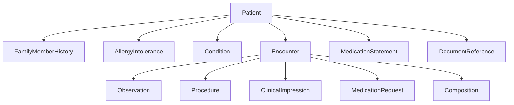

# Jerarquia de Recursos FHIR Implementados

## Recursos por Fase

| Fase | Recursos |
|---|---|
| Identidad | Patient, Practitioner, Organization, RelatedPerson |
| Servicios | HealthcareService, PractitionerRole, Endpoint, Location |
| Encuentro | Encounter, Appointment |
| Clinicos | Observation, Condition, AllergyIntolerance, Procedure, ClinicalImpression |
| Historia | FamilyMemberHistory |
| Medicacion | MedicationStatement, MedicationRequest |
| Documentacion | DocumentReference, Composition |

## Estado General

- **19 recursos** implementados.
- **25 datatypes** implementados.
- **70+ valuesets** implementados.
- Ver tabla completa en [`docs/STATUS.md`](../../../STATUS.md).
